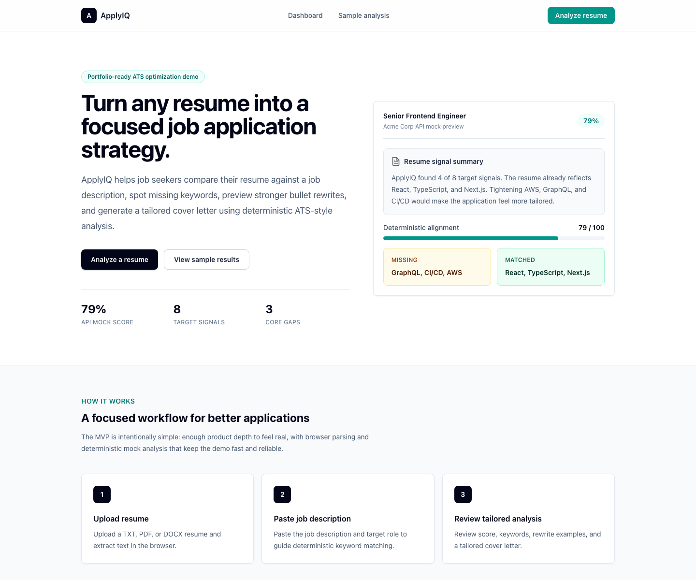
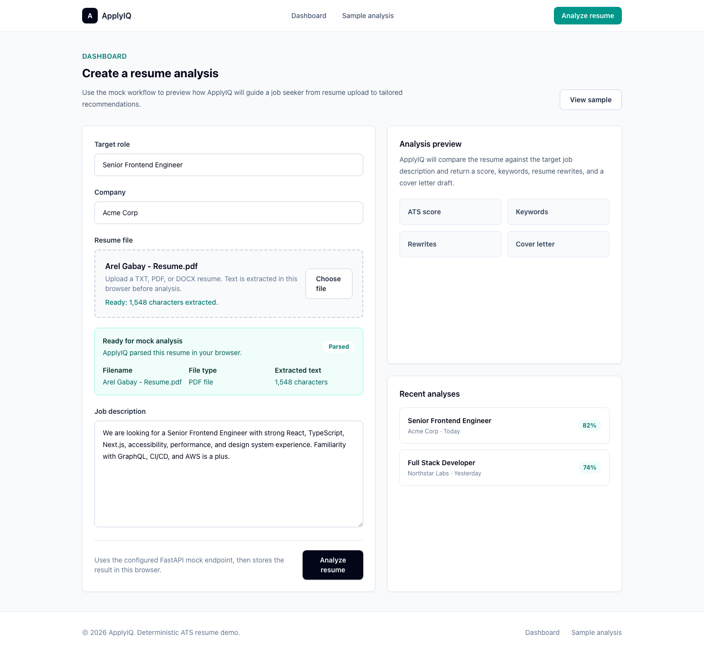
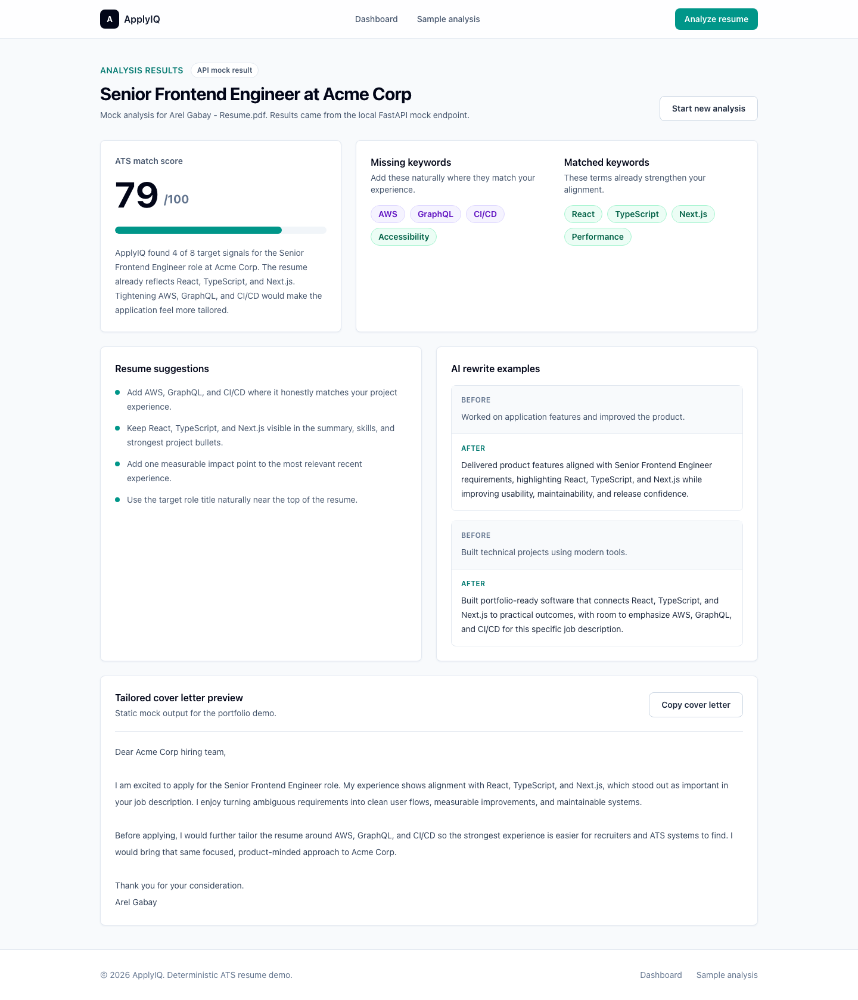

# ApplyIQ

AI-powered ATS resume optimization demo built with Next.js, TypeScript,
Tailwind CSS, and a FastAPI placeholder backend.

> Live demo: <https://applyiq-arel.vercel.app>  
> Public API: <https://applyiq-api-arel.vercel.app/health>

ApplyIQ is a portfolio-ready job application assistant. The MVP uses polished
browser parsing and deterministic mock analysis to demonstrate how a user could
upload a resume, compare it with a job description, and receive ATS-focused
guidance.

## Why I built this

Job seekers often know their resume needs to be tailored, but it is hard to see
which keywords, skills, and proof points matter for a specific role. ApplyIQ
turns that messy comparison into a focused product workflow: upload a resume,
paste a job description, and review a clear application strategy.

## What this demonstrates

- Production-style Next.js app structure with TypeScript and Tailwind CSS
- A polished multi-page product flow with realistic deterministic output
- ATS scoring, keyword gap analysis, resume rewrite examples, and cover letter preview
- Deterministic keyword matching from uploaded resume text and job descriptions
- Frontend-first MVP thinking with a documented FastAPI path for future backend work
- Public deployment on Vercel with a portfolio-ready README

## Demo walkthrough

1. Open the live demo and choose **Analyze resume**.
2. Upload a TXT, PDF, or DOCX resume; text is extracted in the browser.
3. Paste a job description and confirm the target role/company.
4. Submit the workflow to call the public FastAPI mock API.
5. Review the ATS-style score, matched keywords, missing keywords, rewrite examples, and cover letter preview.

## MVP status

- Landing page with product positioning and sample analysis preview
- Dashboard workflow for TXT/PDF/DOCX resume upload, browser-side text extraction, role/company details, and job description input
- Analysis results with deterministic mock ATS score, missing keywords, matched keywords, resume suggestions, AI rewrite examples, and cover letter preview
- Copyable mock cover letter output
- FastAPI mock endpoint that compares extracted resume text against the job description using a fixed keyword bank

## Screenshots

### Landing page



### Dashboard workflow



### Analysis results



## Tech stack

| Area      | Tech                                      |
| --------- | ----------------------------------------- |
| Frontend  | Next.js, TypeScript, Tailwind CSS         |
| Backend   | FastAPI, Python mock API                  |
| Data      | Local samples plus deterministic API mock results |
| AI        | Mock AI output first, OpenAI planned later |
| Database  | PostgreSQL planned later                  |

## Current architecture

- The Next.js frontend handles the full portfolio demo flow and remains usable even if no backend URL is configured.
- Resume text is extracted in the browser from TXT, PDF, and DOCX files; files are not uploaded or stored.
- When `NEXT_PUBLIC_API_URL` is configured, the dashboard sends extracted text and job details to FastAPI.
- The FastAPI mock API compares resume text against the job description using a fixed keyword bank and returns frontend-ready JSON.
- The analysis page reads API results from `sessionStorage`; otherwise it falls back to local sample data.

## Project structure

```text
applyiq/
├── frontend/     # Next.js + TypeScript + Tailwind CSS
├── backend/      # FastAPI placeholder
├── AGENTS.md     # AI agent guidelines
└── README.md
```

## Frontend

### Prerequisites

- Node.js 20.9+ for Next.js 16
- Recommended: run `nvm use` inside `frontend/`

### Run locally

```bash
cd frontend
nvm use
npm install
npm run dev
```

Open [http://localhost:3000](http://localhost:3000).

If a Next.js command reports an old Node version, confirm `node -v` prints
`v20.9.0` or newer after `nvm use`.

### Pages

| Route        | Description                                  |
| ------------ | -------------------------------------------- |
| `/`          | Landing page                                 |
| `/dashboard` | Mock resume analysis workflow                |
| `/analysis`  | Rich mock analysis results and cover letter  |

## Backend

The backend is intentionally light for this phase. It provides a local FastAPI
mock analysis endpoint without becoming a dependency for the deployed frontend.

```bash
cd backend
python -m venv .venv
source .venv/bin/activate
pip install -r requirements.txt
uvicorn app.main:app --reload
```

Routes:

- `GET /health`
- `POST /analysis/mock`

### Connect frontend to local backend

Create a local frontend env file:

```bash
cd frontend
cp .env.example .env.local
```

Then run both apps:

```bash
# terminal 1
cd backend
source .venv/bin/activate
uvicorn app.main:app --reload

# terminal 2
cd frontend
npm run dev
```

With `NEXT_PUBLIC_API_URL=http://localhost:8000`, the dashboard submit flow calls
FastAPI, stores the API mock result in `sessionStorage`, and routes to
`/analysis?source=api`. Resume text is extracted in the browser and sent as
`resume_text`; the mock API does not store it. The API uses deterministic keyword
matching against a fixed skill/tool/domain bank to create believable mock scores,
matched keywords, missing keywords, suggestions, rewrites, and cover letter copy.

## Deployment

The current production target is the Next.js app in `frontend/`.

Recommended Vercel settings:

- Framework: Next.js
- Root directory: `frontend`
- Install command: `npm install`
- Build command: `npm run build`
- Node version: 20.x
- Environment variables: none required for the mock MVP

Production deployment:

- <https://applyiq-arel.vercel.app>

Backend deployment:

- Public API: <https://applyiq-api-arel.vercel.app>
- Frontend production `NEXT_PUBLIC_API_URL` points at the public API.

## Future roadmap

1. Integrate OpenAI for scoring, keyword extraction, rewrites, and cover letters.
2. Add PostgreSQL persistence for saved analyses.
3. Add authentication only after the core workflow is useful.

## Notes

The deployed Vercel frontend intentionally works without backend environment
variables by falling back to local mock data. This MVP deliberately avoids
authentication, payments, real ATS integrations, LinkedIn scraping, and
production AI calls. Keyword matching is deterministic demo logic, not real ATS
scoring or OpenAI analysis. The goal is a fast, clean product demo that is easy
to extend.
